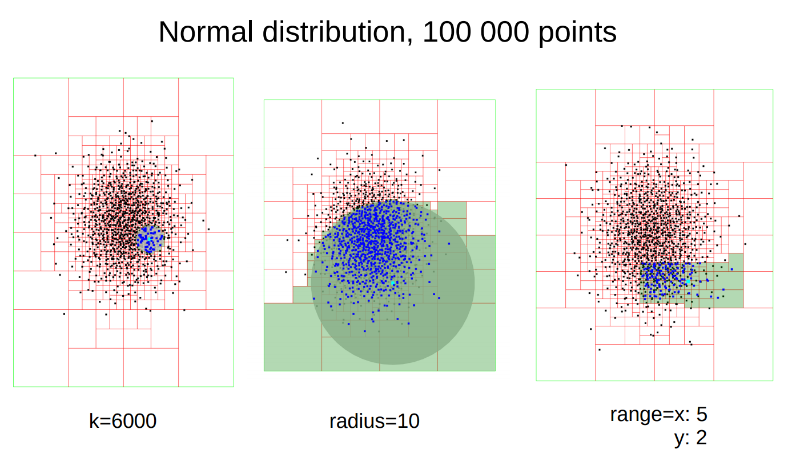

# k-nearest neighbor search and range search with kd-trees

## Assignment
My semestral work submitted in the course on data structures of computer graphis (year 2019). The original assignment: 
Implement k-nearest neighbor search based on kd-trees with sliding midpoint approach. Also implement the range search for rectangular and spherical queries. Test it on various distributions (uniform, Gaussian, scattered Gaussian, exponential etc.) of points in 2D, 3D, and 4D and compare it with the naive implementation. Use the data sets of various size among 10^3 to 10^8. Test the performance for 2 or 3 different implementation of priority queue.

Detailed explanation of the implementation can be found in report or presentations (folders pres/ and report/)

## Required libraries
- VTK
- Boost

## How to run
./project < inputs/< name of input file> 

## Example

